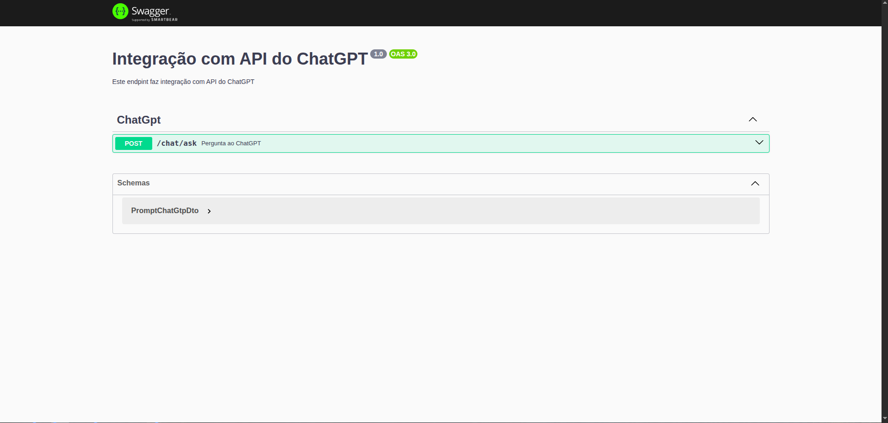
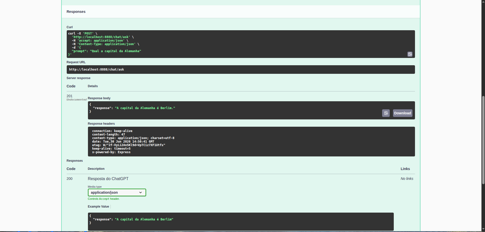
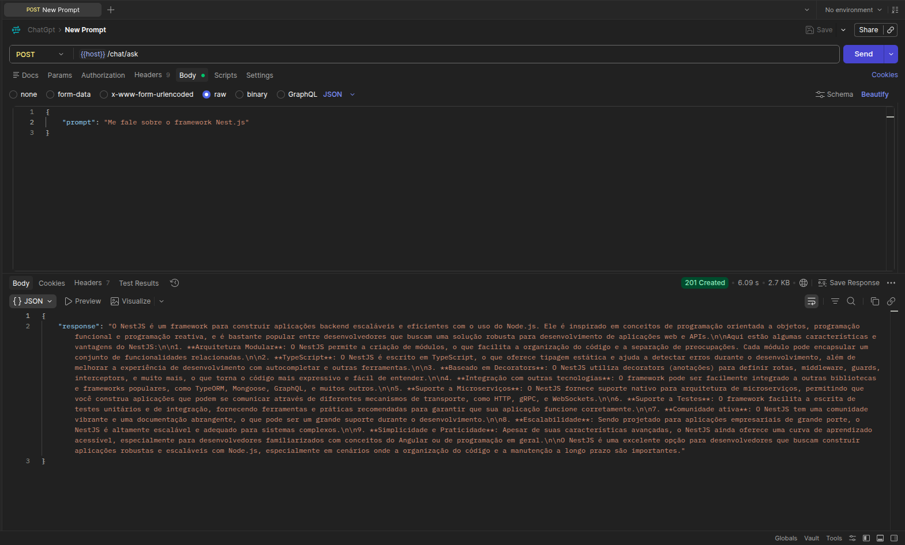

<div align="center">
  
  <br/>
  <br/>

  # 🤖 Integração com API do ChatGPT

  **API REST construída com NestJS para integrar com o modelo GPT-4o-mini da OpenAI**

  <p>
    
    
    
    
    
  </p>

  <p>
    
    
    
  </p>
</div>

---

## 📋 Índice

- [Sobre o Projeto](#-sobre-o-projeto)
- [Arquitetura](#-arquitetura)
- [Stack Tecnológica](#-stack-tecnológica)
- [Pré-requisitos](#-pré-requisitos)
- [Instalação e Execução](#-instalação-e-execução)
- [API](#-api)
- [Screenshots](#-screenshots)
- [Estrutura do Projeto](#-estrutura-do-projeto)
- [Scripts Disponíveis](#-scripts-disponíveis)
- [Variáveis de Ambiente](#-variáveis-de-ambiente)
- [Testes](#-testes)
- [Licença](#-licença)

---

## 💡 Sobre o Projeto

Este projeto é uma **API REST** desenvolvida com **NestJS** que atua como um proxy entre o cliente e a **API de Chat Completions da OpenAI**. Ela expõe um endpoint que aceita um prompt textual, encaminha a requisição para o modelo **GPT-4o-mini** e retorna a resposta gerada pela inteligência artificial.

### Funcionalidades

- ✅ Envio de prompts para o ChatGPT (GPT-4o-mini)
- ✅ Validação de requisições com `class-validator`
- ✅ Documentação interativa via **Swagger** (`/api`)
- ✅ Tratamento de erros e limites de cota (HTTP 429)
- ✅ Configuração via variáveis de ambiente

---

## 🏗 Arquitetura

O projeto segue a **arquitetura modular do NestJS**, organizada por funcionalidades:

```
                        ┌─────────────────────────────────────┐
                        │           Cliente HTTP              │
                        │     (Postman / Frontend / curl)     │
                        └──────────────┬──────────────────────┘
                                       │
                                       │ POST /chat/ask
                                       │ { "prompt": "..." }
                                       ▼
                        ┌─────────────────────────────────────┐
                        │         AppModule (Raiz)             │
                        │  ┌───────────────────────────────┐  │
                        │  │     ChatGptModule             │  │
                        │  │  ┌─────────────────────────┐  │  │
                        │  │  │   ChatGptController     │  │  │
                        │  │  │   (validação & rota)    │  │  │
                        │  │  └──────────┬──────────────┘  │  │
                        │  │             │                  │  │
                        │  │  ┌──────────▼──────────────┐  │  │
                        │  │  │    ChatGptService       │  │  │
                        │  │  │   (lógica de negócio)   │  │  │
                        │  │  └──────────┬──────────────┘  │  │
                        │  └─────────────┼─────────────────┘  │
                        └────────────────┼────────────────────┘
                                         │
                                         │ HTTPS
                                         ▼
                        ┌─────────────────────────────────────┐
                        │     OpenAI API (api.openai.com)     │
                        │  POST /v1/chat/completions          │
                        │  Modelo: gpt-4o-mini                │
                        └─────────────────────────────────────┘
```

### Fluxo da Requisição

1. O cliente envia um `POST /chat/ask` com `{ "prompt": "mensagem" }`
2. O **ValidationPipe** global valida os campos da requisição
3. O **ChatGptController** recebe a requisição e chama o serviço
4. O **ChatGptService** monta o payload e faz uma requisição HTTP para a OpenAI
5. A resposta da OpenAI é extraída e retornada ao cliente no formato `{ "response": "texto" }`
6. Em caso de erro (cota excedida, chave inválida, etc.), retorna **HTTP 429**

---

## 🛠 Stack Tecnológica

| Categoria        | Tecnologia                                                    |
| ---------------- | ------------------------------------------------------------- |
| **Runtime**      | [Node.js](https://nodejs.org/) >= 18                          |
| **Linguagem**    | [TypeScript](https://www.typescriptlang.org/) ^5.7.3          |
| **Framework**    | [NestJS](https://nestjs.com/) ^11.0.1                         |
| **HTTP Client**  | [Axios](https://axios-http.com/) ^1.16.0                      |
| **Validação**    | [class-validator](https://github.com/typestack/class-validator) + [class-transformer](https://github.com/typestack/class-transformer) |
| **API Docs**     | [@nestjs/swagger](https://docs.nestjs.com/openapi/introduction) ^11.0.6 (Swagger) |
| **Config**       | [@nestjs/config](https://docs.nestjs.com/techniques/configuration) ^4.0.1 |
| **Testes**       | [Jest](https://jestjs.io/) + [Supertest](https://github.com/ladjs/supertest) |
| **Lint/Format**  | [ESLint](https://eslint.org/) ^9 + [Prettier](https://prettier.io/) ^3.4 |
| **Compilador**   | [SWC](https://swc.rs/) (compilação rápida)                   |

---

## ✅ Pré-requisitos

- **Node.js** >= 18
- **npm** >= 9
- Uma **chave de API da OpenAI** com créditos disponíveis ([obter chave](https://platform.openai.com/api-keys))

---

## 🚀 Instalação e Execução

```bash
# 1. Clone o repositório
$ git clone <seu-repo>

# 2. Instale as dependências
$ npm install

# 3. Configure a chave da OpenAI
$ cp .env.example .env
# Edite o arquivo .env e adicione sua OPENAI_API_KEY

# 4. Execute em desenvolvimento (com hot-reload)
$ npm run dev

# 5. Acesse a API
#    Endpoint: http://localhost:3000/chat/ask
#    Swagger:  http://localhost:3000/api
```

A aplicação estará disponível na porta definida em `PORT` (padrão: `3000`).

---

## 📡 API

### `POST /chat/ask`

Envia um prompt para o ChatGPT e retorna a resposta gerada.

#### Request

```json
{
  "prompt": "Qual a capital da Alemanha?"
}
```

#### Response (200 OK)

```json
{
  "response": "A capital da Alemanha é Berlim"
}
```

#### Response (429 Too Many Requests)

```json
{
  "message": "Você excedeu sua cota atual. Verifique seu plano e detalhes de faturamento.",
  "error": "Too Many Requests",
  "statusCode": 429
}
```

#### Response (400 Bad Request)

```json
{
  "message": ["prompt must be a string"],
  "error": "Bad Request",
  "statusCode": 400
}
```

> A documentação interativa completa está disponível no **Swagger** em [`/api`](http://localhost:3000/api) quando a aplicação estiver em execução.

---

## 📸 Screenshots

> *Espaço reservado para capturas de tela das principais telas/ferramentas do projeto.*

### Swagger UI — Documentação Interativa

<div align="center">
  
  <br/>
  <em>Interface do Swagger exibindo o endpoint POST /chat/ask com opção de "Try it out".</em>
</div>

### Teste no Swagger — Requisição e Resposta

<div align="center">
  
  <br/>
  <em>Exemplo de requisição enviada pelo Swagger com prompt e resposta recebida do ChatGPT.</em>
</div>

### Postman — Collection

<div align="center">
  
  <br/>
  <em>Requisição sendo feita pelo Postman utilizando a collection disponível em <code>Postman/</code>.</em>
</div>

> 💡 **Dica:** Coloque suas imagens na pasta `src/public/img/screenshots/` e atualize os caminhos acima conforme necessário. Para criar essa pasta, execute:
> ```bash
> $ mkdir -p src/public/img/screenshots
> ```

---

## 📁 Estrutura do Projeto

```
integracao-chatgpt/
├── .env.example                 # Exemplo de variáveis de ambiente
├── .gitignore
├── .prettierrc                  # Configuração do Prettier
├── eslint.config.mjs            # Configuração do ESLint (flat config)
├── nest-cli.json                # Configuração do NestJS CLI
├── package.json
├── tsconfig.json                # Configuração do TypeScript
├── tsconfig.build.json          # Configuração de build
├── Postman/
│   └── ChatGpt.postman_collection.json   # Collection do Postman
├── src/
│   ├── main.ts                  # Bootstrap da aplicação
│   ├── app.module.ts            # Módulo raiz
│   ├── chat-gpt/                # Módulo de integração com ChatGPT
│   │   ├── chat-gpt.module.ts   # Definição do módulo
│   │   ├── chat-gpt.controller.ts  # Endpoints REST
│   │   ├── chat-gpt.service.ts     # Lógica de negócio
│   │   ├── dtos/
│   │   │   └── prompt-chat-gtp.dto.ts  # DTO de validação
│   │   └── excetions/
│   │       └── quota-exceeded.exception.ts  # Exceção de cota
│   └── public/
│       └── img/
│           ├── chatgpt-open-ai.jpg    # Banner do projeto
│           └── screenshots/           # Screenshots das telas
└── test/
    ├── app.e2e-spec.ts          # Teste end-to-end
    └── jest-e2e.json            # Configuração dos testes E2E
```

---

## 📜 Scripts Disponíveis

| Comando             | Descrição                                        |
| ------------------- | ------------------------------------------------ |
| `npm run build`     | Compila TypeScript para `dist/`                  |
| `npm run start`     | Executa em modo de desenvolvimento               |
| `npm run dev`       | Executa com hot-reload (recomendado para dev)    |
| `npm run start:prod`| Executa a build de produção                      |
| `npm run lint`      | Verifica e corrige problemas de lint             |
| `npm run format`    | Formata o código com Prettier                    |
| `npm test`          | Executa testes unitários                         |
| `npm run test:watch`| Executa testes em modo observação                |
| `npm run test:cov`  | Executa testes com cobertura                     |
| `npm run test:e2e`  | Executa testes end-to-end                        |

---

## 🔐 Variáveis de Ambiente

| Variável          | Obrigatório | Padrão  | Descrição                          |
| ----------------- | :---------: | ------- | ---------------------------------- |
| `OPENAI_API_KEY`  |     ✅      | —       | Chave de API da OpenAI             |
| `PORT`            |     ❌      | `3000`  | Porta onde o servidor será iniciado |

> Crie um arquivo `.env` na raiz do projeto baseado no `.env.example` para configurar as variáveis.

---

## 🧪 Testes

```bash
# Testes unitários
$ npm test

# Testes end-to-end
$ npm run test:e2e

# Cobertura de testes
$ npm run test:cov
```

---

## 📄 Licença

Este projeto é de uso privado — **UNLICENSED**.
